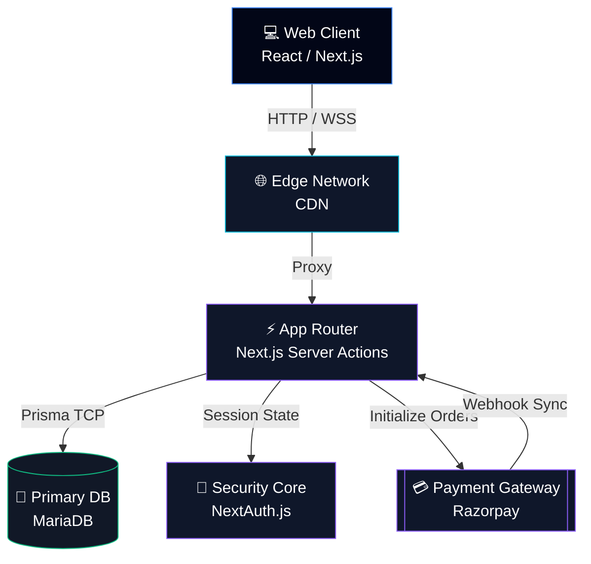

<div align="center">

<!-- Modern Minimalist Header -->

 


<br/><br/>

<h1 align="center" style="border-bottom: none; margin-bottom: 0;"><strong>[ RENTAL :: MGT ]</strong></h1>
<p align="center" style="font-family: monospace; color: #8B5CF6; letter-spacing: 0.1em; font-size: 14px;">PROPERTY RENTAL INFRASTRUCTURE</p>

<a href="https://git.io/typing-svg">
  
</a>

<p align="center">
  <em>A high-performance, dark-themed platform for modern property management, powered by decoupled Server Actions and robust payment queues.</em>
</p>

<p align="center">
  
  
  
  
  
</p>

<p align="center">
  <a href="#-core-architecture"><b>Architecture</b></a> &nbsp;&bull;&nbsp;
  <a href="#-infrastructure-setup"><b>Setup</b></a> &nbsp;&bull;&nbsp;
  <a href="#-feature-matrix"><b>Features</b></a> &nbsp;&bull;&nbsp;
  <a href="#-rbac-personas"><b>Roles</b></a>
</p>

</div>

---

## ⚡ Feature Matrix

Rental Mgt embraces a strictly minimal, tech-forward aesthetic. It removes UX bottlenecks with pure speed, ditching heavy client loads for instantaneous, Server-Side Rendered performance.

| Capability | Module | Description |
| :--- | :--- | :--- |
| **Role-Based RBAC** | `NextAuth` | First-party register/login with secure session tokens, plus global `admin`, `owner`, and `tenant` roles. |
| **Financial Pipeline** | `Razorpay Flow` | Non-blocking financial settlement via fully integrated Razorpay checkout and backend webhook verification. |
| **Property Control** | `Listing Engine` | Imperative approval circuits. Search pipelines ensure 100% localized accuracy by rent, area, and dates. |
| **Booking Matrices** | `Booking System` | Distills requested stay allocations into distinct tracking states, avoiding logical clashing of property dates. |
| **Zero-Latency UI** | `Shadcn Renderer` | Hardware-accelerated UI components via TailwindCSS. Zero-bloat OLED-optimized dark interface. |

<br/>

## 🏗️ Core Architecture

A highly decoupled, full-stack topology. The monolithic Next.js application has been strictly partitioned into localized domains allowing infinite horizontal scaling over Vercel/Node instances.



<br/>

## 🚀 Infrastructure Setup

Bootstrapping the entire constellation of services can be done via Docker (Recommended) or standard Node.js.

> [!IMPORTANT]
> Ensure ports `3000` (Next.js) and `3306` (MariaDB) are open on your host machine.

### Method A: Docker Compose (Recommended)

Requires Docker Desktop or Docker Engine installed.

```bash
# 1. Clone & initialize environment
git clone <repository_url>
cd rental-management-system

# 2. Configure variables
cp .env.example .env
# Important: Docker maps 'database' hostname. No need to change DATABASE_URL from default.
# Add your Razorpay & NextAuth keys to docker-compose.yml or .env

# 3. Boot up the topology and build the image
docker-compose up -d --build
```

### Method B: Standard Implementation

Requires Node.js and a locally running MariaDB/MySQL instance.

```bash
# 1. Clone & install dependencies
git clone <repository_url>
cd rental-management-system
npm install

# 2. Configure variables (requires .env from .env.example)
# Add your Razorpay keys, DB URI, and NextAuth bindings

# 3. Inject initial DB schemas and generated Edge clients
npx prisma db push
npx prisma generate

# 4. Boot up development topology
npm run dev
```

### 📡 Telemetry & Access

| Intranet Target | Port Bind | Responsibility |
| :--- | :--- | :--- |
| **Control Panel UI** | `localhost:3000` | The primary frontend interface. |
| **Prisma Studio** | `localhost:5555` | (npx prisma studio) Database table explorer. |

<br/>

## 👤 RBAC Personas

The database tracks three core permission layers. Production onboarding is completely self-serve through the credentials/OAuth registration endpoints.

| Rank | Capabilities |
| :--- | :--- |
| `[ADMIN]` | Global R/W. System-wide dashboard moderation, user suspension, and global payment insight. |
| `[OWNER]` | Queue isolation. Dashboard for listing management, confirming bookings, and viewing property income. |
| `[TENANT]`| Self-serve property browsing, integrated Razorpay execution, and review generation. |

<br/>

## 🧠 System Development

Located within the `/src/generated` and root configurations, operational scripts maintain schema alignment and code consistency.

```bash
# 1. Update Database topology based on pending migrations
npx prisma migrate dev

# 2. Re-compile TailwindCSS / PostCSS bundles
npm run build

# 3. Analyze Typescript nodes & DOM trees
npm run lint
```
